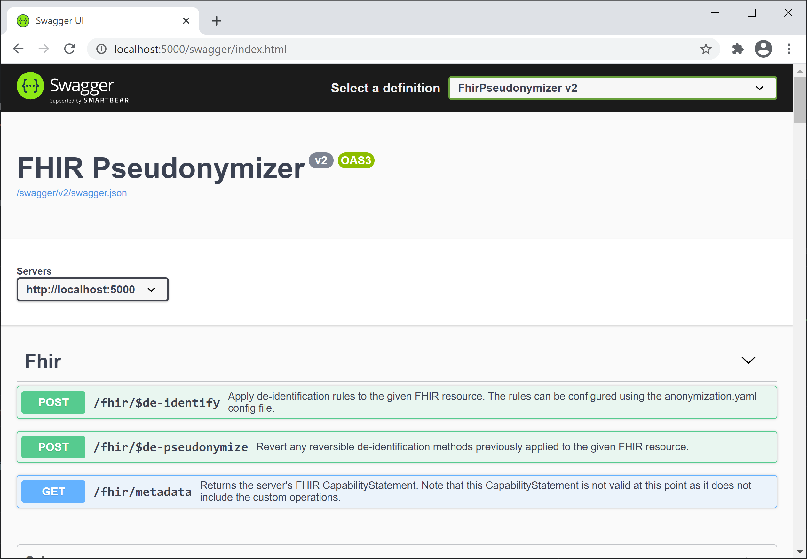

# FHIR® Pseudonymizer

[](https://api.securityscorecards.dev/projects/github.com/miracum/fhir-pseudonymizer)
[](https://slsa.dev)

<p align="center"></p>

> Send a FHIR® resource to `/fhir/$de-identify` get it back anonymized and/or pseudonymized.

Based on the brilliant [Tools for Health Data Anonymization](https://github.com/microsoft/Tools-for-Health-Data-Anonymization).

## Usage

```sh
docker run --rm -i -p 8080:8080 \
  -e PseudonymizationService="None" \
  -e UseSystemTextJsonFhirSerializer="true" \
  ghcr.io/miracum/fhir-pseudonymizer:v2.21.11

curl -X POST -H "Content-Type:application/fhir+json" "http://localhost:8080/fhir/\$de-identify" -d @benchmark/observation.json
```

This uses the [default anonymization config](./src/FhirPseudonymizer/anonymization.yaml) which only changes the sample Observation's `id`.

An example for deploying using (Docker) Compose can be found in the [compose folder](./compose/README.md).

The recommended deployment is on Kubernetes. See <https://github.com/miracum/charts/tree/master/charts/fhir-pseudonymizer> for a Helm Chart.

### API Endpoints

An OpenAPI definition for the FHIR operation endpoints is available at `/swagger/`:



#### `$de-identify`

The server provides a `/fhir/$de-identify` operation to de-identfiy received FHIR resources according to the configuration in the [anonymization.yaml](src/FhirPseudonymizer/anonymization.yaml) rules. See [Tools for Health Data Anonymization](https://github.com/microsoft/Tools-for-Health-Data-Anonymization) for more details on the anonymization rule configuration.

The service comes with a sample configuration file to help meet the requirements of HIPAA Safe Harbor Method (2)(i): [hipaa-anonymization.yaml](src/FhirPseudonymizer/hipaa-anonymization.yaml).This configuration can be used by setting `AnonymizationEngineConfigPath=/etc/hipaa-anonymization.yaml`.

A new `pseudonymize` method was added to the default list of anonymization methods linked above. It uses either [gPAS](https://www.ths-greifswald.de/en/researchers-general-public/gpas/), [Vfps](https://github.com/miracum/vfps), or entici to create pseudonyms and replace the values in the resource with them.
For example, the following rule replaces all identifiers of type `http://terminology.hl7.org/CodeSystem/v2-0203|MR` with a pseudonym generated in the `PATIENT` domain.

```yaml
fhirPathRules:
  - path: nodesByType('Identifier').where(type.coding.system='http://terminology.hl7.org/CodeSystem/v2-0203' and type.coding.code='MR').value
    method: pseudonymize
    domain: PATIENT
```

Note that if the `domain` setting is omitted, and an ID or reference is pseudonymized, then the resource name is used as the pseudonym domain. For example, pseudonymizing `"reference": "Patient/123"` will try to create a pseudonym for `123` in the `Patient` domain.

When using [Vfps](https://github.com/miracum/vfps), the `domain` setting can instead also be set as `namespace`.

Note that all methods defined in [Tools for Health Data Anonymization](https://github.com/microsoft/Tools-for-Health-Data-Anonymization) are supported.
For example, to clamp a patient's birthdate if they were born before January 1st 1931 to 01/01/1930, use:

```yaml
fhirPathRules:
  - path: Patient.birthDate
    method: generalize
    cases:
      "$this < @1931-01-01": "@1930-01-01"
    otherValues: keep
```

#### `$de-pseudonymize`

The `/fhir/$de-pseudonymize` operation is used to revert the `pseudonymize` and `encrypt` methods applied to any resource.
Accessing this endpoint requires authentication. So make sure to set the `APIKEY` env var.

> ⚠ if decryption or de-pseudonymization of a value fails, then the original value is returned. This behavior may change or be made configurable in the future.

#### `:8081/metrics`

While not part of the "user" API, the application exposes metrics in the Prometheus format at the `/metrics` endpoint on port `8081`.

## Configuration

You can configure the anonymization and pseudonymization rules in the `anonymization.yaml` config file.
It's mounted at `/etc/anonymization.yaml` within the container by default.
See <https://github.com/microsoft/FHIR-Tools-for-Anonymization> for details on the syntax and options.

Additionally, there are some optional configuration values that can be set as environment variables:

| Environment Variable                  | Description                                                                                                                                                                                                              | Default                     |
| ------------------------------------- | ------------------------------------------------------------------------------------------------------------------------------------------------------------------------------------------------------------------------ | --------------------------- |
| `AnonymizationEngineConfigPath`       | Path to the `anonymization.yaml` that contains the rules to transform the resources.                                                                                                                                     | `"/etc/anonymization.yaml"` |
| `AnonymizationEngineConfigInline`     | The `anonymization.yaml` as an inline YAML string instead of a separate file. Takes precedence if both `Path` and `Inline` are set.                                                                                      | `""`                        |
| `ApiKey`                              | Key that must be set in the `X-Api-Key` header to allow requests to protected endpoints.                                                                                                                                 | `""`                        |
| `UseSystemTextJsonFhirSerializer`     | Enable the new `System.Text.Json`-based FHIR serializer to significantly [improve throughput and latencies](#usesystemtextjsonfhirserializer). See <https://github.com/FirelyTeam/firely-net-sdk/releases/tag/v4.0.0-r4> | `false`                     |
| `PseudonymizationService`             | The type of pseudonymization service to use. Can be one of `gPAS`, `Vfps`, `entici`, `None`                                                                                                                              | `"gPAS"`                    |
| `MetricsPort`                         | The port where metrics in Prometheus format should be exposed at under the `/metrics` route.                                                                                                                             | `8081`                      |
| `Anonymization__CryptoHashKey`        | Sets the key used by the HMAC SHA256 algorithm. This is an alternative to setting it inside the anonymization.yaml's `parameters` section and useful to more securely set sensitive information.                         | `""`                        |
| `Anonymization__EncryptKey`           | Sets the AES encryption key. This is an alternative to setting it inside the anonymization.yaml's `parameters` section and useful to more securely set sensitive information.                                            | `""`                        |
| `Anonymization__ShouldAddSecurityTag` | Whether the `Resource.meta.security` element should be filled with information about the de-identification methods applied to the resource.                                                                              | `true`                      |

See [appsettings.json](src/FhirPseudonymizer/appsettings.json) for additional options.

The application supports pseudonymization using either [gPAS](https://www.ths-greifswald.de/forscher/gpas/) or [Vfps](https://github.com/miracum/vfps) which can be configured via the `PseudonymizationService` setting.
Service-specific configuration settings are listed below.

### gPAS

| Environment Variable | Description                                                                                                                                                               | Default    |
| -------------------- | ------------------------------------------------------------------------------------------------------------------------------------------------------------------------- | ---------- |
| `gPAS__Url`          | The gPAS TTP FHIR Gateway URL. E.g. `http://localhost:8080/ttp-fhir/fhir/gpas/` for gPAS `2023.1.0`. Used if `PseudonymizationService` is set to `gPAS`.                  | `""`       |
| `gPAS__Version`      | Version of gPAS to support. There were breaking changes to the FHIR API in 1.10.2 and 1.10.3, so explicitely set this value if you are using a version newer than 1.10.1. | `"1.10.1"` |

#### gPAS Basic Auth

| Environment Variable          | Description                                     | Default |
| ----------------------------- | ----------------------------------------------- | ------- |
| `gPAS__Auth__Basic__Username` | The HTTP basic auth username to connect to gPAS | `""`    |
| `gPAS__Auth__Basic__Password` | The HTTP basic auth password to connect to gPAS | `""`    |

#### gPAS OAuth

| Environment Variable               | Description                       | Default |
| ---------------------------------- | --------------------------------- | ------- |
| `gPAS__Auth__OAuth__TokenEndpoint` | The URL of the token endpoint     | `""`    |
| `gPAS__Auth__OAuth__ClientId`      | The client ID                     | `""`    |
| `gPAS__Auth__OAuth__ClientSecret`  | The static (shared) client secret | `""`    |
| `gPAS__Auth__OAuth__Scope`         | The scope                         | `""`    |
| `gPAS__Auth__OAuth__Resource`      | The resource                      | `""`    |

### Vfps

| Environment Variable                            | Description                                                                                                                                                                                                                        | Default |
| ----------------------------------------------- | ---------------------------------------------------------------------------------------------------------------------------------------------------------------------------------------------------------------------------------- | ------- |
| `Vfps__Address`                                 | The Vfps service address. Use `dns:///` scheme for client-side load-balancing.                                                                                                                                                     | `""`    |
| `Vfps__UnsafeUseInsecureChannelCallCredentials` | If set to `true`, `CallCredentials` are applied to gRPC calls made by an insecure channel. Sending authentication headers over an insecure connection has security implications and shouldn't be done in production environments.  | `true`  |
| `Vfps__UseTls`                                  | If set to `true`, creates client-side SSL credentials loaded from disk file pointed to by the `GRPC_DEFAULT_SSL_ROOTS_FILE_PATH` environment variable. If that fails, gets the roots certificates from a well known place on disk. | `false` |

#### Vfps Basic Auth

| Environment Variable          | Description                                                                                                                               | Default |
| ----------------------------- | ----------------------------------------------------------------------------------------------------------------------------------------- | ------- |
| `Vfps__Auth__Basic__Username` | The HTTP basic auth username to connect to the Vfps service. Used in the `Authorization: Basic` metadata header value for the gRPC calls. | `""`    |
| `Vfps__Auth__Basic__Password` | The HTTP basic auth password to connect to the Vfps service.                                                                              | `""`    |

### entici

| Environment Variable | Description                                                                                            | Default |
| -------------------- | ------------------------------------------------------------------------------------------------------ | ------- |
| `entici__Url`        | The entici service base URL for FHIR operations. Used if `PseudonymizationService` is set to `entici`. | `""`    |

When using entici as a pseudonymization backend, you need to set additional settings for each rule that uses the `pseudonymize` method. These can be set under a `entici` section inside the anonymization config:

```yaml
fhirPathRules:
  - path: nodesByType('Identifier').where(type.coding.where(system='http://terminology.hl7.org/CodeSystem/v2-0203' and code='MR').exists()).value
    method: pseudonymize
    # the domain will be used as the system of the identifier when invoking the entici pseudonymize operation
    domain: https://fhir.example.com/identifiers/patient-id
    entici:
      # the type of FHIR resource this pseudonym should be associated with
      resourceType: Patient
      # (optional) the project within entici the pseudonym is a part of
      project: some-internal-entici-project-name
```

#### entici OAuth

| Environment Variable                 | Description                       | Default |
| ------------------------------------ | --------------------------------- | ------- |
| `entici__Auth__OAuth__TokenEndpoint` | The URL of the token endpoint     | `""`    |
| `entici__Auth__OAuth__ClientId`      | The client ID                     | `""`    |
| `entici__Auth__OAuth__ClientSecret`  | The static (shared) client secret | `""`    |
| `entici__Auth__OAuth__Scope`         | The scope                         | `""`    |
| `entici__Auth__OAuth__Resource`      | The resource                      | `""`    |

## Dynamic rule settings

Anonymization and pseudonymization rules in the `anonymization.yaml` config file can be overridden and/or extended on a per request basis.

Pseudonymization supports a `domain-prefix` rule setting which can be used to dynamically configure the target domain by providing its value as part of the request body.

The following example shows how to use this feature to use a single service configuration in order to support multiple projects which have the same basic domain names, prefixed by a project name.

### Example

gPAS domains for patient IDs:

| project |          domain |
| ------- | --------------: |
| miracum | miracum-patient |
| test    |    test-patient |

`anonymization.yml`:

```yml
---
fhirVersion: R4
fhirPathRules:
  - path: nodesByType('Identifier').where(type.coding.system='http://terminology.hl7.org/CodeSystem/v2-0203' and type.coding.code='MR').value
    method: pseudonymize
    domain: patient
```

Providing the prefix (i.e. miracum- or test-) via the request, pseudonymization can be done with the same rules for different projects.

#### Request body

Rule settings can be provided by using the `Parameters` resource with a `settings` parameter and parts consisting of the settings key and value.
The `resource` parameter must contain the actual target resource.

The following request body and the (fixed) configuration settings above will result in the target domain `miracum-patient`.

```json
{
  "resourceType": "Parameters",
  "parameter": [
    {
      "name": "settings",
      "part": [
        {
          "name": "domain-prefix",
          "valueString": "miracum-"
        }
      ]
    },
    {
      "name": "resource",
      "resource": {
        "resourceType": "Bundle",
        "type": "transaction",
        "entry": [
          {
            "fullUrl": "urn:uuid:3bc44de3-069d-442d-829b-f3ef68cae371",
            "resource": {
              "resourceType": "Patient",
              "identifier": [
                {
                  "type": {
                    "coding": [
                      {
                        "system": "http://terminology.hl7.org/CodeSystem/v2-0203",
                        "code": "MR"
                      }
                    ]
                  },
                  "system": "http://acme.org/mrns",
                  "value": "12345"
                }
              ],
              "name": [
                {
                  "family": "Jameson",
                  "given": ["J", "Jonah"]
                }
              ],
              "gender": "male"
            },
            "request": {
              "method": "POST",
              "url": "Patient/12345"
            }
          }
        ]
      }
    }
  ]
}
```

Note: The domain name could also have been replaced completely by overriding the `domain` setting with the desired value. This works for all rule settings regardless of the `method` value.

## Development

### Start Development Fixtures (optional)

To test Vfps and tracing via Jaeger, run

```sh
docker compose -f compose.dev.yaml up
```

to also start a Keycloak instance with pre-configured fhir-pseudonymizer client, set `--profile=keycloak`:

```sh
docker compose -f compose.dev.yaml --profile=keycloak up
```

### Build

```sh
dotnet restore
dotnet build
```

Or using Docker:

```sh
docker build -t ghcr.io/miracum/fhir-pseudonymizer:local-build .
```

### Run

```sh
dotnet run --project src/FhirPseudonymizer
```

### Test

```sh
dotnet test src/FhirPseudonymizer.Tests/
```

### Install Pre-commit Hooks

```sh
pre-commit install
pre-commit install --hook-type commit-msg
```

### Run iter8 SLO experiments locally

```sh
ITER8_CLI_URL="https://github.com/iter8-tools/iter8/releases/download/v0.13.18/iter8-linux-amd64.tar.gz"
curl -LSs "${ITER8_CLI_URL}" | tar xz
mv linux-amd64/iter8 /usr/local/bin/iter8
chmod +x /usr/local/bin/iter8
iter8 version

kind create cluster

export IMAGE_TAG="iter8-test"

docker build -t ghcr.io/miracum/fhir-pseudonymizer:${IMAGE_TAG} .

kind load docker-image ghcr.io/miracum/fhir-pseudonymizer:${IMAGE_TAG}

helm upgrade --install \
  --set="image.tag=${IMAGE_TAG}" \
  -f tests/iter8/values.yaml \
  --wait \
  --timeout=10m \
  fhir-pseudonymizer oci://ghcr.io/miracum/charts/fhir-pseudonymizer

kubectl apply -f tests/iter8/experiment.yaml

iter8 k assert -c completed --timeout 15m
iter8 k assert -c nofailure,slos
iter8 k report

# to restart:
kubectl delete job default-1-job
kubectl apply -f tests/iter8/experiment.yaml
```

## Benchmark

> **Note**
> Example runs were conducted on the following hardware:

```console
OS=Windows 11 (10.0.22000.978/21H2)
12th Gen Intel Core i9-12900K, 1 CPU, 24 logical and 16 physical cores
32GiB of DDR5 4800MHz RAM
Samsung SSD 980 Pro 1TiB
.NET SDK=7.0.101
```

Prerequisites: <https://github.com/codesenberg/bombardier>

```sh
dotnet run -c Release --project=src/FhirPseudonymizer
```

In a different terminal

```sh
cd benchmark/
$ ./bombardier.sh

Bombarding http://localhost:5000/fhir/$de-identify for 1m0s using 125 connection(s)
[====================================================================================================================] 1m0s
Done!
Statistics        Avg      Stdev        Max
  Reqs/sec     13107.78    1552.49   18917.77
  Latency        9.53ms   559.41us    53.88ms
  Latency Distribution
     50%     9.00ms
     75%    11.00ms
     90%    12.00ms
     95%    13.00ms
     99%    16.73ms
  HTTP codes:
    1xx - 0, 2xx - 786655, 3xx - 0, 4xx - 0, 5xx - 0
    others - 0
  Throughput:    96.37MB/s
```

### UseSystemTextJsonFhirSerializer

You can improve throughput and P99 latencies by opting-in to using the System.Text.Json based FHIR resource serializer.
It can be enabled via `appsettings.json` or using the `UseSystemTextJsonFhirSerializer` environment variable:

```sh
UseSystemTextJsonFhirSerializer=true dotnet run -c Release --project=src/FhirPseudonymizer
```

```console
Bombarding http://localhost:5000/fhir/$de-identify for 1m0s using 125 connection(s)
[====================================================================================================================] 1m0s
Done!
Statistics        Avg      Stdev        Max
  Reqs/sec     21508.39    3751.90   38993.50
  Latency        5.80ms     1.63ms   442.82ms
  Latency Distribution
     50%     5.00ms
     75%     6.00ms
     90%     7.75ms
     95%     9.00ms
     99%    12.00ms
  HTTP codes:
    1xx - 0, 2xx - 1291159, 3xx - 0, 4xx - 0, 5xx - 0
    others - 0
  Throughput:   158.17MB/s
```

## Image signature and provenance verification

Prerequisites:

- [cosign](https://github.com/sigstore/cosign/releases)
- [slsa-verifier](https://github.com/slsa-framework/slsa-verifier/releases)
- [crane](https://github.com/google/go-containerregistry/releases)

All released container images are signed using [cosign](https://github.com/sigstore/cosign) and SLSA Level 3 provenance is available for verification.

```sh
IMAGE=ghcr.io/miracum/fhir-pseudonymizer:v2.21.11
DIGEST=$(crane digest "${IMAGE}")
IMAGE_DIGEST_PINNED="ghcr.io/miracum/fhir-pseudonymizer@${DIGEST}"
IMAGE_TAG="${IMAGE#*:}"

cosign verify \
   --certificate-oidc-issuer=https://token.actions.githubusercontent.com \
   --certificate-identity-regexp="https://github.com/miracum/.github/.github/workflows/standard-build.yaml@.*" \
   --certificate-github-workflow-name="ci" \
   --certificate-github-workflow-repository="miracum/fhir-pseudonymizer" \
   --certificate-github-workflow-trigger="release" \
   --certificate-github-workflow-ref="refs/tags/${IMAGE_TAG}" \
   "${IMAGE_DIGEST_PINNED}"

slsa-verifier verify-image \
    --source-uri github.com/miracum/fhir-pseudonymizer \
    --source-tag ${IMAGE_TAG} \
    --source-branch master \
    "${IMAGE_DIGEST_PINNED}"
```

## Semantic versioning exclusion policies

The project's versioning follows the [SemVer](https://semver.org/) convention.
However, we exclude metrics (ie. anything under the `:8081/metrics` endpoint), traces, and the contents of the container image from this.
Always be prepared to double-check the release notes before updating.

## Attribution

Icons made by [Freepik](https://www.freepik.com) from [Flaticon](https://www.flaticon.com/).
